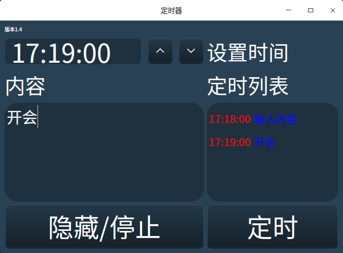

# clock

#### 介绍
linux 定时闹钟 使用qt5开发

#### 软件使用说明
界面如下：

添加开机自启动
修改clock.desktop后复制到~/.config/autostart/即可

使用介绍：

一，设置时间和内容，点击定时会在定时列表中显示设置定时的任务，定时任务列表存储多次定时。

二，定时设置完成后，点 “隐藏/停止” 按钮界面被隐藏，直到第一个定时的任务时时到了，才会自动弹出窗口，并播放软件目录中的音乐。

三，如果有多个任务，再次点击 “隐藏/停止” 按钮界面会再次隐藏并停止播放音乐。

#### 安装教程
方法一: 下载安装包，解压后执行clock.sh 即可
<pre>
 wget https://gitee.com/xinghuowangluo/clock/attach_files/1098755/download/clockv1.4.tar.gz
</pre>

方法二：编译源码

版本更新：
v1.6增加永久保存功能
